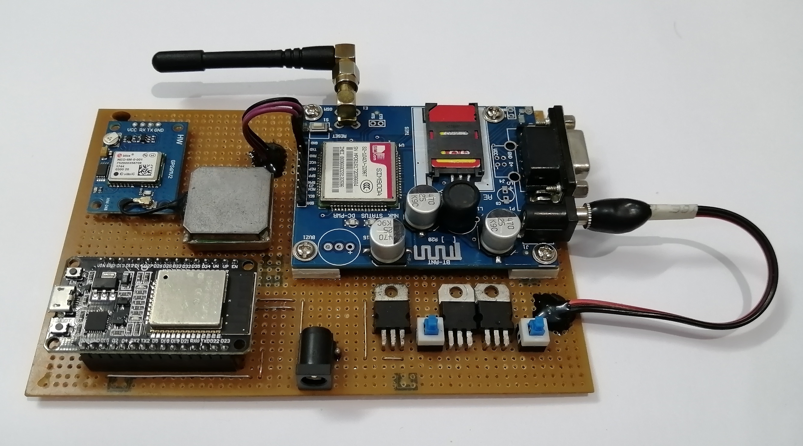
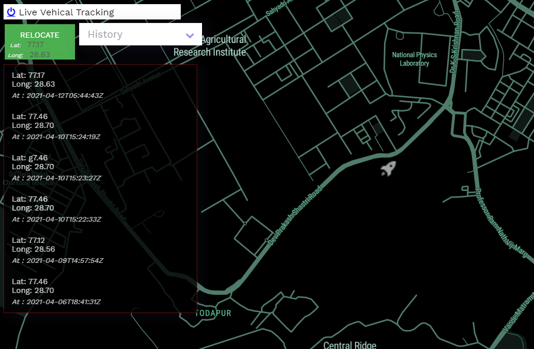
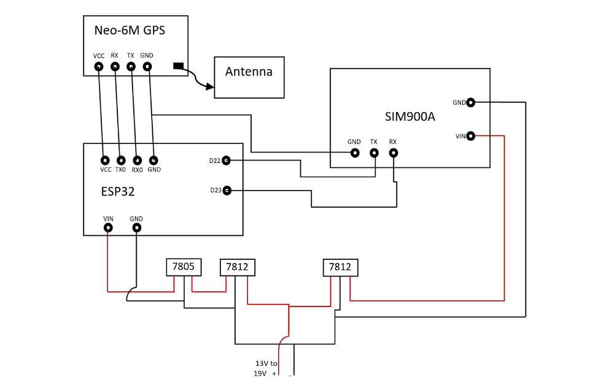

# 🚗 Real-Time Vehicle Tracking System

> An IoT-based GPS Vehicle Tracking System using **ESP32**, **NEO-6M GPS**, **SIM900A GSM/GPRS**, **ThingSpeak Cloud**, **PHP Backend**, and **Mapbox GL JS** for real-time vehicle monitoring and live map visualization.

<p align="center">
  
  
</p>

---

# 🌐 Live Demo

## 🔗 Web Dashboard
👉 [Open Live Demo](https://abhyuday-bbd.000webhostapp.com/login_track.php)

## 🔐 Demo Credentials

```txt
Username : username
Password : password
```

---

# 📌 Project Overview

The **Real-Time Vehicle Tracking System** is an IoT-enabled embedded solution that continuously monitors and tracks a vehicle's live location using GPS satellites and GSM/GPRS internet communication.

The system:
- Receives live GPS coordinates from the **NEO-6M GPS module**
- Processes them using an **ESP32 microcontroller**
- Sends data to the cloud using the **SIM900A GSM module**
- Stores coordinates on **ThingSpeak**
- Displays live movement on an interactive **Mapbox dashboard**

This project combines:
- Embedded Systems
- IoT Communication
- Cloud APIs
- GPS Navigation
- Web Development
- Real-Time Data Visualization

---

# 🖼️ Project Gallery

---

## 🔧 Hardware Prototype

<p align="center">
  
  
</p>

---

## 🗺️ Live Tracking Dashboard

<p align="center">
  
</p>

---

## ⚡ Circuit Diagram

<p align="center">
  
</p>

---

# 🚀 Features

## 📍 Real-Time GPS Tracking
- Continuous live location monitoring
- Real-time coordinate updates
- GPS satellite synchronization

## 🛰️ GSM/GPRS Communication
- Internet communication using SIM900A
- TCP/IP based data transfer

## ☁️ Cloud Integration
- ThingSpeak API integration
- Coordinate storage and retrieval
- Remote data accessibility

## 🗺️ Interactive Map Dashboard
- Mapbox GL JS integration
- Real-time marker movement
- Auto relocation and fly animation

## 🕓 Location History
- Historical coordinate logs
- Timestamp-based tracking history

## 🔐 Authentication System
- Secure login/logout
- PHP session-based authentication

## 📱 Responsive UI
- Mobile-friendly interface
- Bootstrap-powered frontend

## 📡 Geofencing Ready
- Easily extendable for geofence alerts
- Fleet management support

---

# 🏗️ System Architecture

```text
+------------------+
| GPS Satellites   |
+--------+---------+
         |
         v
+------------------+
| NEO-6M GPS       |
| Module           |
+--------+---------+
         |
         v
+------------------+
| ESP32 Controller |
+--------+---------+
         |
         v
+------------------+
| SIM900A GSM/GPRS |
+--------+---------+
         |
         v
+------------------+
| ThingSpeak Cloud |
+--------+---------+
         |
         v
+------------------+
| PHP Web Server   |
+--------+---------+
         |
         v
+------------------+
| Mapbox Dashboard |
+------------------+
```

---

# ⚙️ Working Principle

1. The **NEO-6M GPS module** receives satellite signals.
2. Latitude and longitude are extracted.
3. ESP32 processes GPS coordinates.
4. SIM900A establishes GPRS internet connection.
5. Coordinates are uploaded to ThingSpeak cloud.
6. PHP backend fetches latest coordinates.
7. Mapbox dashboard displays vehicle location in real time.

---

# 🔌 Hardware Components

| Component | Description |
|---|---|
| ESP32 DevKit | Main microcontroller |
| NEO-6M GPS Module | GPS coordinate acquisition |
| SIM900A GSM Module | Internet/GPRS communication |
| LM7805 | 5V voltage regulator |
| LM7812 | 12V voltage regulator |
| Capacitors | Voltage stabilization |
| GPS Antenna | Satellite signal reception |
| GSM Antenna | Cellular communication |
| Power Supply | Vehicle battery |

---

# 💻 Software Stack

| Technology | Purpose |
|---|---|
| Arduino IDE | Firmware development |
| Embedded C/C++ | ESP32 programming |
| PHP | Backend server |
| HTML/CSS/JS | Frontend |
| Bootstrap | UI framework |
| jQuery | AJAX handling |
| Mapbox GL JS | Real-time maps |
| ThingSpeak API | Cloud storage |
| 000webhost | Hosting |

---

# 🔧 Hardware Connections

## ESP32 ↔ GPS Module

| ESP32 | NEO-6M |
|---|---|
| RX | TX |
| TX | RX |
| GND | GND |
| VIN | VCC |

---

## ESP32 ↔ SIM900A

| ESP32 | SIM900A |
|---|---|
| RX | TX |
| TX | RX |
| GND | GND |
| VIN | VCC |

---

# 📂 Project Structure

```bash
real-time-vehicle-tracking-system/
│
├── firmware/
│   ├── main.ino
│
├── web/
│   ├── geolocation.php
│   ├── login.php
│   ├── logout.php
│
├── images/
│   ├── Device1.jpg
│   ├── Device3.jpg
│   ├── tracking.png
│   ├── Circuit.png
│
├── docs/
│   ├── Major_Project_Report.pdf
│
└── README.md
```

---

# 🛠️ Installation & Setup

## 1️⃣ Clone Repository

```bash
git clone https://github.com/lokeshkumar80/real-time-vehicle-tracking-system.git
cd real-time-vehicle-tracking-system
```

---

## 2️⃣ Hardware Setup

- Connect ESP32 with:
  - NEO-6M GPS Module
  - SIM900A GSM Module
- Insert active SIM card
- Connect antennas properly
- Provide stable power supply

---

## 3️⃣ Configure ThingSpeak

- Create ThingSpeak channel
- Enable:
  - Field1 → Latitude
  - Field2 → Longitude
- Copy API keys

---

## 4️⃣ Update Firmware

Replace:

```cpp
your_api_key
```

with your actual ThingSpeak API key.

---

## 5️⃣ Upload Firmware

Using Arduino IDE:
- Select ESP32 Board
- Select COM Port
- Upload firmware

---

## 6️⃣ Configure Web Dashboard

Replace:

```javascript
mapboxgl.accessToken
```

with your Mapbox token.

Update:
```php
read_api_thingspeak
```

with your ThingSpeak Read API endpoint.

---

# 📡 API Communication

## Sending GPS Data

```http
GET https://api.thingspeak.com/update?api_key=YOUR_API_KEY&field1=LATITUDE&field2=LONGITUDE
```

---

## Fetching GPS Data

```http
GET https://api.thingspeak.com/channels/CHANNEL_ID/feeds.json
```

---

# 📸 Dashboard Screenshots

## 🔐 Login Page

<p align="center">
  
</p>

---

## 📍 Live Location Tracking

<p align="center">
  
</p>

---

# 📊 Applications

- Fleet Management
- Vehicle Theft Detection
- Public Transport Monitoring
- Logistics Tracking
- School Bus Tracking
- Military Vehicle Monitoring
- Emergency Response Systems
- Smart Transportation

---

# 🔮 Future Scope

- 🚨 Accident Detection
- 📲 Mobile Application
- 🔔 SMS Emergency Alerts
- 📍 Geofence Notifications
- 📈 Analytics Dashboard
- ☁️ MQTT/Firebase Migration
- 🧠 AI-based Route Prediction
- 🔋 Battery Optimization
- 🚗 Multi-Vehicle Support

---

# 🧪 Technologies Demonstrated

- Embedded Systems
- IoT Communication
- GPS Navigation
- GSM/GPRS Networking
- UART Communication
- REST APIs
- Cloud Computing
- Real-Time Visualization

---

# 📈 Performance

| Parameter | Value |
|---|---|
| GPS Accuracy | ~2.5m |
| Update Frequency | ~2 sec |
| Controller | ESP32 |
| Communication | GSM/GPRS |
| Cloud API | ThingSpeak |
| Mapping | Mapbox |

---

# 🎥 Related Demo Videos

## GPS + GSM Vehicle Tracking
- ESP32 GPS Vehicle Tracking
- SIM900A GPRS Communication
- Mapbox Real-Time Tracking
- IoT Fleet Monitoring

---

# 📚 References

- ESP32 Documentation
- TinyGPS++ Library
- Mapbox GL JS Docs
- ThingSpeak API Docs
- SIM900A Datasheet
- NEO-6M Datasheet

---

# 🤝 Contributing

Contributions are welcome!

```bash
Fork → Clone → Create Branch → Commit → Push → Pull Request
```

---

# 📜 License

This project is licensed under the MIT License.

---

# 👨‍💻 Author

## Lokesh Kumar

🚀 Embedded Systems & IoT Enthusiast

### 🔗 GitHub
https://github.com/lokeshkumar80

---

# ⭐ Support

If you found this project useful:

⭐ Star the repository  
🍴 Fork the project  
📢 Share it with others

---

# 📌 Project Highlights

✅ Real-Time GPS Tracking  
✅ ESP32 + GSM + GPS Integration  
✅ Cloud-Based Monitoring  
✅ Live Map Visualization  
✅ IoT Architecture  
✅ Full Stack Dashboard  
✅ Vehicle Monitoring System  
✅ Embedded + Web Integration  
